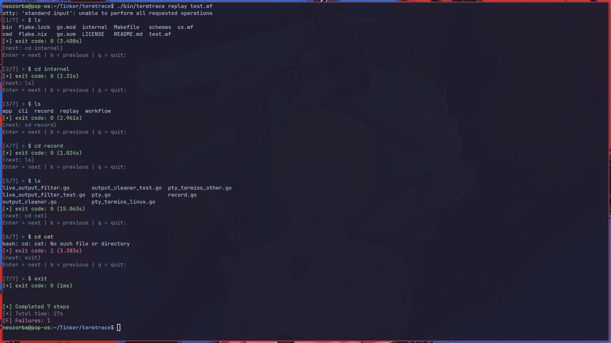
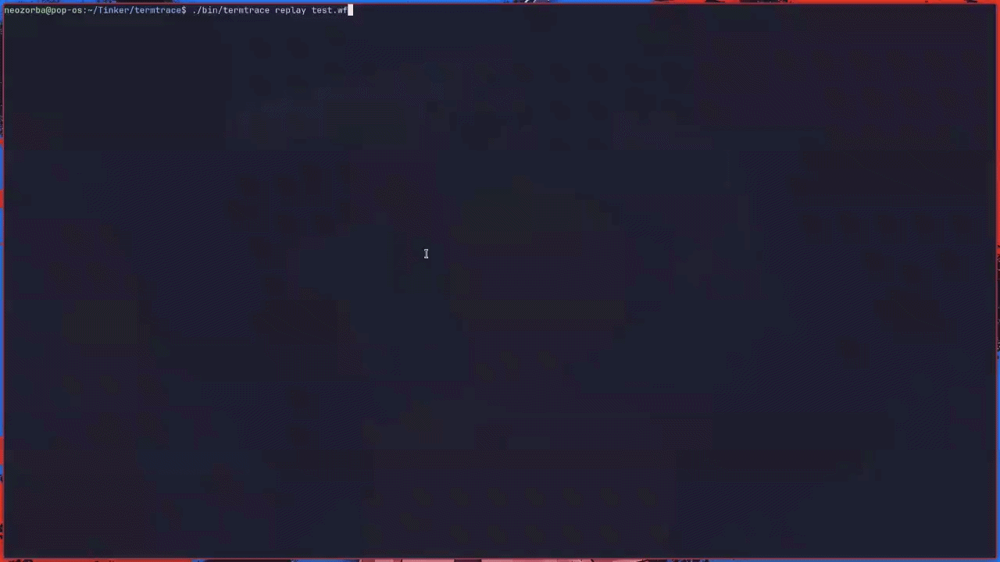

<p align="center">
  
</p>

<h1 align="center">termtrace</h1>

<p align="center">
  <a href="https://github.com/AmalChandru/termtrace/actions/workflows/ci.yml"></a>
  <a href="https://github.com/AmalChandru/termtrace/blob/main/LICENSE"></a>
  <a href="https://github.com/AmalChandru/termtrace/releases"></a>
</p>

<p align="center">
  <b>Replay your terminal workflows, exactly as they happened.</b>
</p>

<p align="center">
  <a href="#install">Install</a> &middot;
  <a href="#features">Features</a> &middot;
  <a href="#commands">Commands</a> &middot;
  <a href="#comparison">Comparison</a> &middot;
  <a href="#technical">Technical</a>
</p>


The `termtrace` captures commands, outputs, and context so sessions can be replayed as they happened, not reconstructed. It provides a deterministic, machine-readable trace, sitting between shell history (lossy) and screen recording (unstructured).

<p align="center">
  
</p>


## Why
Terminal workflows are hard to reproduce. The commands are scattered in shell history, the outputs are lost, and the context is easy to forget. Often times recreating what actually happened becomes a guesswork. The `termtrace` can turn terminal sessions into something you can replay.

## Install

#### 1. Download binary 
Download from the [releases](https://github.com/AmalChandru/termtrace/releases) page.

#### 2. Build from source
```shell
git clone https://github.com/AmalChandru/termtrace.git
cd termtrace
make build 
```
The build will be available at: `./bin/termtrace`

## Features 
#### Recording
- Records terminal session in a real shell (PTY).
- Captures commands, outputs, and execution flow.
- Stores each step with timestamp and duration.
- Tracks exit codes for every command.


#### Replay
- Step-by-step replay of recorded sessions.
- See commands, outputs, and failures as they happened.
- Navigate forward, backward, or run automatically.
- Highlights errors and non-zero exits.

<p align="center">
  
</p>

#### Trace
- Stores sessions as a structured `.wf` file ([JSON](/home/neozorba/Tinker/termtrace/schemas/wf-v1.json)).
- Machine-readable and deterministic.
- Includes:
  - command
  - `stdout` / `stderr`
  - exit code
  - timestamp
  - duration


## Usage

#### Global
```shell
termtrace [flags] <command>

termtrace --help
termtrace --version
```

#### Commands
| Command | Purpose |
|---------|---------|
|`termtrace record`|Start an interactive recording session.|
|`termtrace replay <workflow.wf>`| Replay a `.wf` file step by step.|
| `termtrace stop`| Intended to stop recording (still **not implemented**; errors at runtime), a mere `exit` will do the trick.

##### record
```shell
termtrace record [-o path | --output path]
```
- `-o` / `--output`: workflow file to write (default: `session.wf`)

##### replay
````shell
termtrace replay [--auto | -y] [--step N] <workflow.wf>
````
- `--auto` / `-y`: run all steps without pausing between them
- `--step N`: start at step N (1-based; default 1)

##### stop
```shell
termtrace stop
```
(No flags; not wired up yet..)

#### Examples
```shell
termtrace record -o demo.wf
termtrace replay demo.wf
termtrace replay -y demo.wf
termtrace replay --step 3 demo.wf
```
#### Interactive replay (no --auto)
Between steps you’ll see `(next: …)` and:
- `Enter` → next step
- `b` / `back` → previous step (within the replay window)
- `q` / `quit` → exit replay

If stdout/stderr is truncated, `o` then `Enter` expands it.


## Comparison

| Tool               | Captures commands | Captures output | Replayable | Structured | Deterministic |
|--------------------|------------------|-----------------|------------|------------|---------------|
| Shell history      | partial          | no              | no         | no         | no            |
| Screen recording   | yes              | yes             | no         | no         | no            |
| Copy/paste docs    | manual           | partial         | no         | no         | no            |
| **termtrace**     | yes              | yes             | yes        | yes        | yes           |
## Technical

The `termtrace` prioritizes **deterministic capture over perfectly emulating** an interactive shell.

It runs your shell inside a pseudo-terminal (PTY). Your input is forwarded to the PTY master, while the shell runs on the slave side. Each step corresponds to a command submitted with Enter. Everything the PTY outputs until the next command is captured as that step’s stdout.

For bash and zsh, hooks emit a small `__TT_RC__:` marker before the prompt. This allows exit codes to be parsed and removed from both the saved workflow and the live output..

Steps are stored as versioned JSON 1 (`.wf`).

Replay does not execute commands again. It prints the recorded output and metadata. Truncation, colors, and navigation are part of the display layer only.

### Limitations

- **Not your full shell**  
  Uses a minimal shell setup to keep capture stable. Behavior may differ from your usual environment.

- **Line-based capture**  
  One command per line. Advanced shell interactions are not deeply integrated.

- **TUIs / full-screen apps**  
  May not record or replay faithfully.

- **Timings**  
  `duration_ms` measures time until the next command, not exact process runtime.

- **Replay fidelity**  
  Replay shows exactly what was captured. `stderr` may not always be separated depending on PTY behavior.

### Roadmap

- Better input handling and shell integration (tab completion, user shell fidelity)
- Improved capture and replay for TUIs and full-screen apps
- Replay execution mode (re-run steps instead of just printing output)

## Status
Early development. APIs and file formats may change.

## License
MIT
